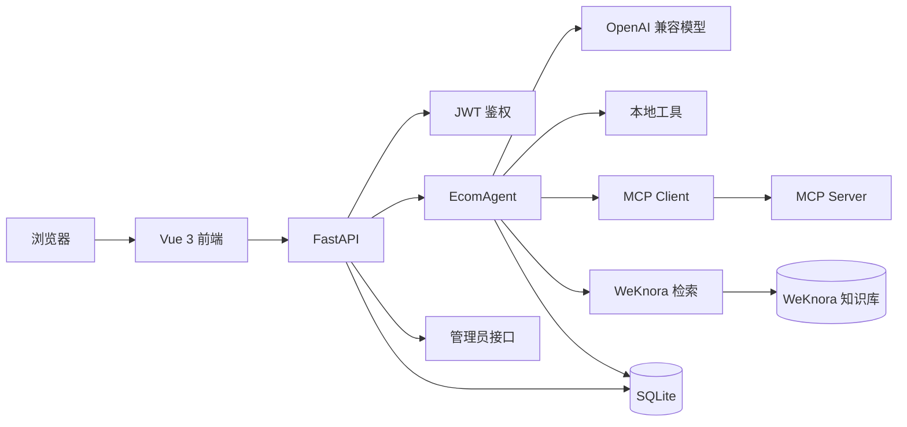

=# 极客商城智能客服 Agent

这是一个用 Python 搭建的电商客服 Agent 学习项目，客服名字叫“小极”。

项目把大模型、工具调用、MCP、RAG、会话记忆、用户登录和管理员后台串在了一起。它适合用来学习一个 Agent 项目从模型调用到 Web 应用的完整过程。

## 1. 能做什么

| 模块 | 功能 |
| --- | --- |
| 用户 | 注册、登录、JWT 鉴权、普通用户和管理员角色 |
| 会话 | 新建会话、切换会话、保存历史消息、删除会话 |
| 客服 | 订单查询、物流查询、商品搜索、退换货咨询、退款和人工转接 |
| 知识库 | 查询配送说明、退换货政策和 FAQ；用户可以管理自己的 Markdown 知识库 |
| 订单 | 查看订单、创建订单、取消订单、申请退款 |
| 管理员 | 查看用户、订单、退款、会话和聊天记录 |
| 部署 | 本地启动或 Docker Compose 启动 |

## 2. 技术栈

| 类别 | 技术 | 作用 |
| --- | --- | --- |
| 后端 | Python 3.11、FastAPI、Uvicorn | HTTP API 和服务启动 |
| Agent | OpenAI 兼容 SDK、Pydantic | 调用模型和校验结构化回复 |
| 工具 | Function Calling、MCP 2.0 | 让模型决定是否调用业务工具 |
| 知识库 | WeKnora | 文档解析、切片、向量化、混合检索和知识库管理 |
| 数据库 | SQLite | 用户、订单、退款、会话和消息；本地默认模式 |
| 缓存/限流 | Redis（可选） | 多进程共享登录失败限流 |
| 鉴权 | JWT、Argon2 密码哈希 | 登录和接口权限控制 |
| 前端 | Vue 3、Vite | 用户聊天页面和管理员后台 |
| 测试 | unittest、FastAPI TestClient、Locust | 接口测试和基础压测 |
| 部署 | Docker、Docker Compose、Nginx | 容器化运行前后端 |

## 3. 系统架构



这张图是项目的简化架构，方便快速了解整体组成。完整的文件、模块和依赖关系由 Understand Anything 生成，图谱数据在 [`.ua/knowledge-graph.json`](.ua/knowledge-graph.json)。

本地查看交互式图谱：

```text
/understand-dashboard C:\Users\Kevin\Desktop\agent\ecom-service-agent-learning
```

### 一次聊天的流程

```text
用户发送问题
  -> FastAPI 校验 JWT 和请求参数
  -> EcomAgent 加载当前用户的会话和历史消息
  -> 模型判断是否需要调用工具
  -> 调用本地工具、MCP 工具或 RAG
  -> 工具结果回到模型
  -> 模型生成客服回复
  -> 保存会话、消息和摘要到 SQLite
  -> API 只返回给用户看的纯文本
```

### 工具调用

本地工具定义在 `agent/tools/registry.py`，当前包括：

- `query_order`：查询订单
- `query_logistics`：查询物流
- `search_product`：搜索商品
- `apply_refund`：申请退款
- `search_knowledge`：搜索知识库

Agent 启动时会尝试连接 `MCP Server`。如果 MCP 没有启动，Agent 会自动使用本地工具继续运行。当前 MCP Server 示例只暴露了订单查询工具。

## 4. WeKnora 知识库

2.0 默认使用 WeKnora。WeKnora 负责文档解析、切片、向量化、混合检索和知识库管理，当前项目只负责调用它的接口。

管理员或 Agent 所有者可以在页面上传 Markdown。第一次上传时，如果没有填写知识库 ID，系统会自动创建 WeKnora 知识库；之后通过保存的知识库 ID 查询。

WeKnora 需要单独下载并运行，服务地址默认是 `http://127.0.0.1:8080`。它自己的 PostgreSQL、Redis 和文档解析服务由 WeKnora Compose 管理，不要把 WeKnora 的内部表接到当前项目数据库中。

### WeKnora 配置顺序

1. 进入 WeKnora 独立目录，运行 `docker compose up -d`。
2. 打开 WeKnora 页面 `http://127.0.0.1:8081`，配置可用的 Embedding 模型和模型 API Key。
3. 把 WeKnora 模型名称（例如 `text-embedding-v1`）或模型 `id` 填入当前项目的 `WEKNORA_EMBEDDING_MODEL_ID`。当前项目首次创建知识库时会自动读取 WeKnora 模型列表，把名称转换成真实 ID。
4. `WEKNORA_KNOWLEDGE_BASE_ID` 可以留空。第一次上传 Markdown 时，当前项目会自动创建知识库并保存本地 ID；如果已经有知识库，也可以直接填写它的 ID。
5. 启动当前项目后，从项目页面上传 Markdown。上传成功后需要等待状态变为 `completed`，再开始提问。

WeKnora 后端健康地址是 `http://127.0.0.1:8080/health`，WeKnora 页面地址是 `http://127.0.0.1:8081`。

### 离线备用方案

如果暂时不启动 WeKnora，可以在 `.env` 中设置：

```text
KNOWLEDGE_PROVIDER=local
```

本地备用方案的文档放在 `knowledge` 目录：

```text
knowledge/
├─ FAQ.md
├─ 配送说明.md
└─ 退换货政策.md
```

更新本地备用文档后重新生成切片和索引：

```powershell
uv run python -m agent.rag.chunker
uv run python -m agent.rag.indexer
```

处理过程：

```text
Markdown 文档
  -> 按标题和 FAQ 问题切片
  -> 调用 Embedding 模型生成向量
  -> 保存到 data/index.json
  -> 用户提问时计算相似度
  -> 把相关片段交给 Agent
```

本地方案只作为离线学习备用。正式使用时优先继续使用 WeKnora，不需要在当前项目里重复实现一套向量数据库。

## 5. Agent 配置和权限

普通用户登录后可以创建自己的私有 Agent。Agent 的配置文件和知识库目录由服务端生成，用户不能通过请求参数修改存储路径。

用户 Agent 当前只能启用 `search_knowledge`，不能直接启用订单、退款等业务工具，避免把业务数据工具开放给个人配置。管理员仍然可以在管理员接口中配置完整工具组合。

普通用户只能看到：

- 公开 Agent
- 自己拥有的私有 Agent

用户只能修改自己拥有的 Agent，并管理自己 Agent 下的 Markdown 知识库。

每次保存 Agent 配置都会在 `data/agent_versions/` 留下一份快照，最多保留最近 20 个版本。用户只能查看和恢复自己私有 Agent 的版本，管理员可以管理所有 Agent 的版本。删除私有 Agent 时，会同时清理本地知识库目录、版本快照和对应的 WeKnora 知识库。

## 6. 数据库和会话记忆

SQLite 数据库路径：`data/app.db`。

主要数据表：

| 表 | 作用 |
| --- | --- |
| `users` | 用户名、密码哈希和角色 |
| `sessions` | 会话所属用户、标题和摘要 |
| `messages` | 会话中的用户消息和 Agent 回复 |
| `orders` | 订单和物流信息 |
| `refunds` | 退款申请和处理状态 |
| `products` | 商品、价格、库存和描述 |

每个用户只能读取自己的会话、订单和退款。管理员可以通过后台读取所有用户的会话和聊天记录。

当前订单和商品是学习版模拟数据，启动数据库时会自动初始化。它没有连接真实电商订单系统。

## 7. 环境变量

复制模板：

```powershell
Copy-Item .env.example .env
```

然后填写：

| 变量 | 作用 |
| --- | --- |
| `OPENAI_API_KEY` | 模型 API Key |
| `OPENAI_BASE_URL` | OpenAI 官方地址或中转站地址 |
| `MODEL_NAME` | 聊天模型名称 |
| `TEMPERATURE` | 模型温度 |
| `EMBEDDING_MODEL` | RAG 使用的向量模型 |
| `JWT_SECRET` | JWT 签名密钥 |
| `MCP_SERVER_URL` | MCP 服务地址，不启动 MCP 时可保持默认值 |
| `WEKNORA_BASE_URL` | WeKnora 后端地址 |
| `WEKNORA_API_KEY` | WeKnora API Key，只保存在后端环境变量 |
| `WEKNORA_EMBEDDING_MODEL_ID` | WeKnora 的 Embedding 模型名称或 ID，项目会自动解析 |
| `KNOWLEDGE_PROVIDER` | 默认知识库服务，推荐 `weknora`，离线时可用 `local` |
| `WEKNORA_KNOWLEDGE_BASE_ID` | 已有 WeKnora 知识库 ID，留空则首次上传时自动创建 |
| `REDIS_URL` | 可选 Redis 地址，填写后启用共享登录失败限流 |
| `REDIS_TIMEOUT_SECONDS` | Redis 连接超时时间 |
| `CORS_ORIGINS` | 允许访问后端的前端地址，多个地址用英文逗号分隔 |

`.env`、数据库、会话文件和日志不要上传到 GitHub。

当前项目自己的业务数据库仍默认使用 SQLite；Redis 只负责可选的共享限流，WeKnora 使用它自己的 PostgreSQL 和 Redis，不与当前项目直接共用内部表。

当前项目也支持通过 `DATABASE_BACKEND=postgres` 和 `POSTGRES_DSN` 切换自己的业务数据库。默认仍建议使用 SQLite 学习模式，WeKnora 的数据库配置不要填到这里。

## 8. 本地启动

### 后端

安装依赖：

```powershell
uv sync
```

也可以使用 pip：

```powershell
pip install -r requirements.txt
```

启动 FastAPI：

```powershell
uv run uvicorn api.main:app --host 127.0.0.1 --port 8765 --reload
```

### 前端

新开一个终端：

```powershell
cd frontend
npm install
npm run dev
```

本地访问：

- 前端：<http://localhost:5173>
- 后端：<http://127.0.0.1:8765>
- Swagger：<http://127.0.0.1:8765/docs>
- 健康检查：<http://127.0.0.1:8765/health>

### MCP Server（可选）

新开一个终端：

```powershell
uv run python mcp_server/server.py
```

MCP 地址：`http://127.0.0.1:9123/mcp`

即使不启动 MCP，Agent 也会回退到本地工具。

### 命令行版本

```powershell
uv run python main.py
```

命令行聊天中可以输入：

- `reset`：清空当前会话上下文
- `quit` 或 `exit`：退出程序

## 9. Docker Compose 启动

先确保根目录已经有 `.env`，然后运行：

```powershell
docker compose up --build
```

Compose 会启动两个服务：

| 服务 | 容器端口 | 本机访问端口 | 作用 |
| --- | --- | --- | --- |
| `backend` | 8765 | 8765 | FastAPI 和 Agent |
| `frontend` | 80 | 8080 | Nginx 托管 Vue 页面 |

访问：

- 用户页面：<http://localhost:8080>
- 后端健康检查：<http://localhost:8765/health>
- Swagger：<http://localhost:8765/docs>

停止服务：

```powershell
docker compose down
```

`data` 和 `sessions` 会映射到本机目录，容器重建不会自动删除它们。

## 10. 创建管理员

运行：

```powershell
uv run python api/admin_setup.py
```

按提示输入管理员用户名和密码。管理员登录后会进入管理员后台，可以查看：

- 数据概览
- 用户列表
- 订单列表
- 退款记录
- 用户会话和聊天内容

## 11. API 接口

需要登录的接口都要携带：

```text
Authorization: Bearer <JWT>
```

### 公共接口

```text
GET  /health
POST /register
POST /login
GET  /products?keyword=外套
GET  /agents
POST /agents
GET  /agents/{agent_id}
PUT  /agents/{agent_id}
DELETE /agents/{agent_id}
GET  /agents/{agent_id}/knowledge
POST /agents/{agent_id}/knowledge
POST /agents/{agent_id}/knowledge/rebuild
DELETE /agents/{agent_id}/knowledge/{filename}
GET  /agents/{agent_id}/versions
POST /agents/{agent_id}/versions/{version}/restore
```

### 当前用户接口

```text
GET  /me
GET  /orders
POST /orders
GET  /orders/{order_id}
POST /orders/{order_id}/cancel
GET  /refunds
POST /orders/{order_id}/refunds
GET  /sessions
POST /sessions
GET  /sessions/{session_id}/messages
DELETE /sessions/{session_id}
POST /chat
```

聊天请求示例：

```json
{
  "message": "查询订单 ORD-001",
  "session_id": "可选的会话 ID"
}
```

`/chat` 对外返回纯文本，不会把 `intent`、`confidence`、`requires_human` 等内部字段显示给用户。

### 管理员接口

只有管理员 JWT 可以访问：

```text
GET /admin/summary
GET /admin/users
GET /admin/orders
GET /admin/refunds
GET /admin/sessions
GET /admin/sessions/{session_id}/messages
GET /admin/agents/{agent_id}
PUT /admin/agents/{agent_id}
GET /admin/agents/{agent_id}/versions
POST /admin/agents/{agent_id}/versions/{version}/restore
```

完整接口记录见 [API接口清单.md](docs/API接口清单.md)，Swagger 地址是 <http://127.0.0.1:8765/docs>。

## 12. 测试

运行全部 Python 测试：

```powershell
uv run python -m unittest discover -s tests -v
```

编译检查：

```powershell
uv run python -m compileall -q api agent config main.py tests
```

构建前端：

```powershell
cd frontend
npm run build
```

项目已经覆盖登录、会话、聊天纯文本、工具调用、MCP、RAG、订单、退款、管理员权限和异常处理测试。

## 13. 基础压测

启动 Locust：

```powershell
uv run locust -f locustfile.py
```

打开：<http://localhost:8089>

默认压测健康检查、注册、登录、会话、订单和商品接口，不压测 `/chat`，避免大量消耗真实模型费用。

已有一次 1000 虚拟用户的基础压测结果：

```text
总请求数：120284
失败率：约 0.036%
RPS：约 379.5
平均响应时间：约 211.74 ms
P95：约 1100 ms
```

这只是本地开发环境和 SQLite 的结果，不能代表生产容量。详细记录见 [压测记录.md](docs/压测记录.md)。

## 14. 项目目录

```text
ecom-service-agent-learning/
├─ agent/
│  ├─ chat.py              Agent 主循环、工具调用和记忆
│  ├─ database.py          SQLite 表结构和数据操作
│  ├─ presentation.py      清洗对外显示的回复
│  ├─ summarizer.py        历史消息摘要
│  ├─ rag/                 文档切片、Embedding 和检索
│  └─ tools/               订单、物流、商品、退款等工具
├─ api/
│  ├─ main.py              FastAPI 接口
│  ├─ auth.py              注册、登录、JWT 和密码哈希
│  └─ admin_setup.py       创建或设置管理员
├─ frontend/
│  ├─ src/App.vue          用户登录和聊天页面
│  └─ src/components/      管理员后台
├─ mcp_client/             MCP 客户端
├─ mcp_server/             MCP 服务端示例
├─ prompts/                Agent 系统提示词
├─ schemas/                结构化回复模型
├─ knowledge/              RAG 原始 Markdown 文档
├─ data/                   SQLite 和 RAG 索引
├─ docs/                   学习、接口、RAG 和压测记录
├─ tests/                  自动化测试
├─ Dockerfile              后端镜像
├─ compose.yaml            前后端 Compose 配置
├─ .env.example            环境变量模板
└─ README.md               项目说明
```

## 15. 当前限制和后续方向

当前版本是电商学习版 `v2.0`：

- 订单、商品和物流是模拟数据
- MCP 当前只有订单查询示例
- RAG 使用 JSON 索引和全量余弦相似度搜索
- 数据库使用 SQLite
- Agent 配置目前由管理员创建和管理，私有 Agent 可以绑定一个用户
- 没有压测真实模型聊天接口
- 还没有密码找回、短信验证和生产级审计系统

后续版本可以加入真实业务数据库、向量数据库、Redis、模型聊天压测、多进程部署和更完善的运营监控。

## 16. 相关记录

- [学习记录.md](docs/学习记录.md)：开发过程和每一步的说明
- [项目完善计划.md](docs/项目完善计划.md)：后续完善方向
- [API接口清单.md](docs/API接口清单.md)：接口列表
- [swagger.md](docs/swagger.md)：Swagger 测试记录
- [RAG测试记录.md](docs/RAG测试记录.md)：知识库检索测试
- [压测记录.md](docs/压测记录.md)：Locust 压测结果
