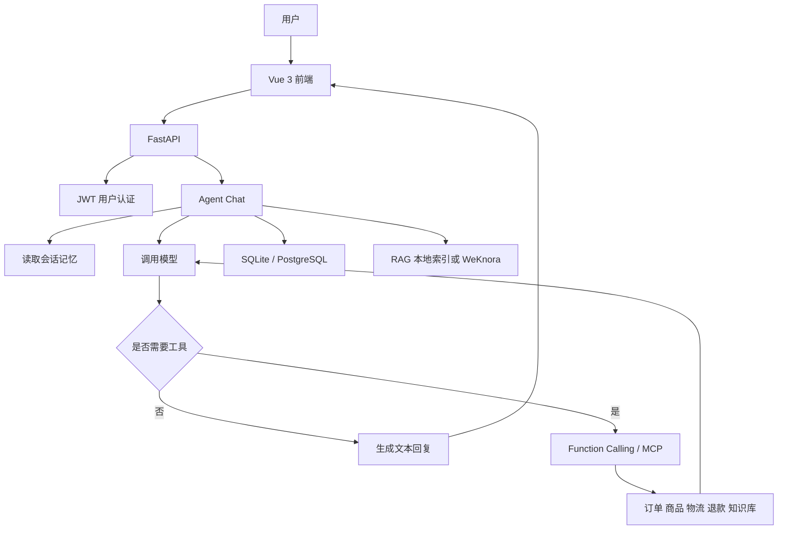

# 可配置客服 Agent

这是一个可配置的 Agent 学习项目。

项目默认提供“极客商城智能客服小极”这个示例，但它不只适用于电商。修改 Agent 配置、提示词和知识库后，也可以改造成其他类型的客服或业务助手。


## 能做什么

- 和 Agent 对话，支持多轮上下文记忆
- 从配置文件读取 Agent 名称、角色、语气、服务范围和提示词
- 通过 Markdown 知识库进行 RAG 检索
- 可选接入 WeKnora 作为外部知识库
- 通过 Function Calling 调用订单、商品、物流、退款和知识库工具
- MCP 不可用时自动回退到本地工具
- 用户注册、登录和 JWT 身份认证
- 每个用户只能访问自己的会话、订单和 Agent 数据
- 管理员查看用户、会话、订单、退款和工具调用记录
- Vue 3 前端聊天页面和管理员页面
- SQLite 默认保存数据，也保留 PostgreSQL 和 Redis 的配置入口

## 默认示例

默认 Agent 是极客商城智能客服“小极”，包含这些演示能力：

- 查询订单
- 查询物流
- 搜索商品
- 咨询退换货和其他商城规则
- 提交退款申请
- 转人工客服

项目中的订单、商品和物流数据是演示数据，不连接真实电商平台。

## 工作流程



## 技术栈

- Python 3.11+
- FastAPI + Uvicorn
- OpenAI 兼容接口
- Pydantic Settings
- SQLite（默认）/ PostgreSQL（可选）
- Redis（可选，用于共享登录限流）
- MCP 2.0
- Vue 3 + Vite
- uv
- Docker Compose

## 本地启动

需要先安装 Python 3.11+、uv 和 Node.js。

在项目根目录执行：

```powershell
Copy-Item .env.example .env
uv sync
```

打开 `.env`，至少填写：

```dotenv
OPENAI_API_KEY=你的模型接口密钥
OPENAI_BASE_URL=你的OpenAI兼容接口地址
MODEL_NAME=你的聊天模型名称
JWT_SECRET=一串较长的随机字符串
```

第一次运行建议使用本地知识库：

```dotenv
KNOWLEDGE_PROVIDER=local
```

启动后端：

```powershell
uv run uvicorn api.main:app --host 127.0.0.1 --port 8765 --reload
```

另开一个终端启动前端：

```powershell
cd frontend
npm install
npm run dev
```

本地访问：

- 前端：http://localhost:5173
- 后端：http://127.0.0.1:8765
- Swagger：http://127.0.0.1:8765/docs
- 健康检查：http://127.0.0.1:8765/health

## 创建管理员账号

管理员不能通过普通注册页面创建。第一次启动项目后，在项目根目录另开一个 PowerShell，执行：

```powershell
uv run python -m api.admin_setup
```

按提示输入管理员用户名和密码。密码输入时不会显示字符，输入完成后直接按回车即可，之后还会要求再次确认密码。

如果用户名已经存在，这个命令会重置密码并把账号提升为管理员；如果不存在，就会创建账号并设置为管理员。

创建完成后，用这个账号在前端登录，会自动进入管理员后台。普通用户登录后只进入客服聊天页面。

## Docker Compose 启动

先确认根目录存在 `.env`，然后执行：

```powershell
docker compose up --build
```

访问：

- 前端：http://localhost:8080
- 后端：http://localhost:8765
- Swagger：http://localhost:8765/docs

Compose 会启动当前项目的后端和前端。WeKnora、PostgreSQL、Redis 是外部可选服务，不会被这个 Compose 文件自动启动。

停止服务：

```powershell
docker compose down
```

## 知识库

### 本地 RAG

把 Markdown 文件放进 `knowledge/`，再执行项目中的知识库构建流程，生成切片和向量索引到 `data/`。使用本地知识库时不需要启动 WeKnora。

### WeKnora

如果已经部署 WeKnora，在 `.env` 中填写：

```dotenv
KNOWLEDGE_PROVIDER=weknora
WEKNORA_BASE_URL=你的WeKnora地址
WEKNORA_API_KEY=你的WeKnora密钥
```

WeKnora 是独立的知识库项目，本项目只通过 API 调用它，不包含 WeKnora 的服务端代码。

## Agent 配置

默认配置在：

```text
configs/agents/ecommerce.json
```

可以修改：

- Agent 名称和欢迎语
- 角色和服务范围
- 语气
- 自定义提示词
- 行为规则和禁止话题
- 启用的工具
- 知识库来源
- 模型名称和温度

Agent 配置由管理员维护。管理员登录后可以配置客服名称、角色、Prompt、知识库、模型和工具；普通用户只能选择公开的 Agent 并进行对话。

管理员接口支持创建新的 Agent：

```text
POST /admin/agents
```

可以在 Swagger 页面中调用，具体字段以接口文档为准。

## 主要目录

```text
agent/              Agent 主循环、记忆、工具和业务逻辑
agent/business/     订单、商品、退款等业务数据访问
agent/integrations/ 外部服务适配器，例如 WeKnora 和物流
agent/rag/          Markdown 切片、向量索引和检索
agent/tools/        Agent 可调用的工具
api/                FastAPI 接口、认证和管理员接口
config/              环境配置和 Agent 配置
configs/agents/     Agent 配置文件
frontend/            Vue 3 前端
knowledge/          Markdown 知识库
mcp_client/         MCP 客户端示例
mcp_server/         MCP 服务端示例
schemas/            请求和响应模型
tests/              接口、工具、RAG、数据库测试
docs/               API、RAG、Compose 和学习记录
```

## 常用 API

- `POST /register`：注册用户
- `POST /login`：登录并获取 JWT
- `GET /me`：获取当前用户
- `POST /chat`：发送消息
- `GET /sessions`：查看自己的会话
- `GET /orders`：查看自己的订单
- `GET /products`：搜索商品
- `GET /agents`：查看可用 Agent
- `GET /admin/summary`：管理员统计
- `GET /admin/sessions`：管理员查看会话
- `POST /admin/agents/{agent_id}/knowledge`：管理员上传知识库文件

完整接口以 Swagger 为准：`http://127.0.0.1:8765/docs`。

## 测试和检查

执行测试：

```powershell
uv run pytest
```

检查 Compose 配置：

```powershell
docker compose config --quiet
```

## 当前限制

- 订单、商品、物流和退款默认是演示数据
- 本项目没有接入真实支付、订单和物流平台
- 本地 RAG 使用项目内的索引文件，规模较大时应换成专用向量数据库
- SQLite 适合学习和小规模使用，高并发场景需要重新设计数据库和缓存
- MCP、WeKnora、PostgreSQL 和 Redis 都是可选能力
- 当前目标是学习和开源复用，不承诺生产环境的安全性、稳定性和并发能力

## 相关文档

- `docs/API接口清单.md`
- `docs/swagger.md`
- `docs/Compose启动说明.md`
- `docs/RAG测试记录.md`
- `docs/学习记录.md`
- `docs/项目完善计划.md`

## 版本说明

`v1.0.0` 是之前的电商客服学习版本；当前分支是在同一项目基础上继续开发的 2.0/2.1 版本。版本区别不影响项目的基本使用方式，具体变化以提交记录和文档为准。
